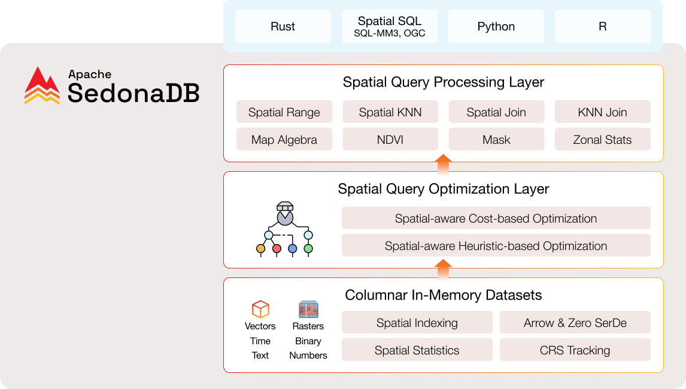

<!---
  Licensed to the Apache Software Foundation (ASF) under one
  or more contributor license agreements.  See the NOTICE file
  distributed with this work for additional information
  regarding copyright ownership.  The ASF licenses this file
  to you under the Apache License, Version 2.0 (the
  "License"); you may not use this file except in compliance
  with the License.  You may obtain a copy of the License at

    http://www.apache.org/licenses/LICENSE-2.0

  Unless required by applicable law or agreed to in writing,
  software distributed under the License is distributed on an
  "AS IS" BASIS, WITHOUT WARRANTIES OR CONDITIONS OF ANY
  KIND, either express or implied.  See the License for the
  specific language governing permissions and limitations
  under the License.
-->

# SedonaDB

SedonaDB is an open-source single-node analytical database engine with **geospatial as the first-class citizen**. It aims to deliver the fastest spatial analytics query speed and the most comprehensive function coverage available.

SedonaDB is perfect for processing smaller to medium datasets on local machines or cloud instances. For distributed workloads, you can leverage the power of SedonaSpark, SedonaFlink, or SedonaSnow.

## Architecture



* **Columnar in-memory datasets**
    * Spatial indexing
    * Spatial statistics
    * CRS tracking
    * Arrow format and zero serialization overhead

* **Spatial query optimization**
    * Spatial-aware heuristic based optimization
    * Spatial-aware cost based optimization

* **Spatial query processing**
    * Spatial range query, KNN query, spatial join query, KNN join query
    * Map algebra, NDVI, mask, zonal statistics

Raster functions are coming soon. We expect SedonaDB Raster will match all raster functions provided in [SedonaSpark](https://sedona.apache.org/latest/api/sql/Raster-operators/).

## Install

You can install Python SedonaDB with PyPI:

```sh
pip install "apache-sedona[db]"
```

## Quick Start

Get started with SedonaDB in just a few lines:

```python
import sedona.db

# Connect to SedonaDB
sd = sedona.db.connect()

# Run a simple spatial query
result = sd.sql("SELECT ST_Point(0, 1) as geom")
result.show()
```

### Supported File Formats

SedonaDB supports a wide range of geospatial file formats:
- **Vector:** GeoParquet, WKT, WKB, all formats supported by GeoPandas
- **Raster:** Coming soon with full SedonaSpark compatibility

## Overture buildings example

This section shows how to query the Overture buildings data.

Start by establishing a connection:

```python
import sedona.db
sd = sedona.db.connect()
```

Set some AWS environment variables to access the data:

```python
os.environ["AWS_SKIP_SIGNATURE"] = "true"
os.environ["AWS_DEFAULT_REGION"] = "us-west-2"
```

Read the dataset into a Python SedonaDB `DataFrame`. This is lazy: even though the Overture buildings table contains millions of rows, SedonaDB will only fetch the data required for the query.

```python
df = sd.read_parquet(
    "s3://overturemaps-us-west-2/release/2025-08-20.0/theme=buildings/type=building/"
)
```

Now run a query to compute the centroids of tall buildings (above 20 meters) in New York City:

```python
nyc_bbox_wkt = (
    "POLYGON((-74.2591 40.4774, -74.2591 40.9176, -73.7004 40.9176, -73.7004 40.4774, -74.2591 40.4774))"
)

sd.sql(f"""
SELECT
    id,
    height,
    num_floors,
    roof_shape,
    ST_Centroid(geometry) as centroid
FROM
    buildings
WHERE
    is_underground = FALSE
    AND height IS NOT NULL
    AND height > 20
    AND ST_Intersects(geometry, ST_SetSRID(ST_GeomFromText('{nyc_bbox_wkt}'), 4326))
LIMIT 5;
""").show()
```

Here's the query output:

```
┌─────────────────────────┬────────────────────┬────────────┬────────────┬─────────────────────────┐
│            id           ┆       height       ┆ num_floors ┆ roof_shape ┆         centroid        │
│         utf8view        ┆       float64      ┆    int32   ┆  utf8view  ┆     wkb <ogc:crs84>     │
╞═════════════════════════╪════════════════════╪════════════╪════════════╪═════════════════════════╡
│ 1b9040c2-2e79-4f56-aba… ┆               22.4 ┆            ┆            ┆ POINT(-74.230407502993… │
├╌╌╌╌╌╌╌╌╌╌╌╌╌╌╌╌╌╌╌╌╌╌╌╌╌┼╌╌╌╌╌╌╌╌╌╌╌╌╌╌╌╌╌╌╌╌┼╌╌╌╌╌╌╌╌╌╌╌╌┼╌╌╌╌╌╌╌╌╌╌╌╌┼╌╌╌╌╌╌╌╌╌╌╌╌╌╌╌╌╌╌╌╌╌╌╌╌╌┤
│ 1b5e1cd2-d697-489e-892… ┆               21.5 ┆            ┆            ┆ POINT(-74.231451103592… │
├╌╌╌╌╌╌╌╌╌╌╌╌╌╌╌╌╌╌╌╌╌╌╌╌╌┼╌╌╌╌╌╌╌╌╌╌╌╌╌╌╌╌╌╌╌╌┼╌╌╌╌╌╌╌╌╌╌╌╌┼╌╌╌╌╌╌╌╌╌╌╌╌┼╌╌╌╌╌╌╌╌╌╌╌╌╌╌╌╌╌╌╌╌╌╌╌╌╌┤
│ c1afdf78-bf84-4b8f-ae1… ┆               20.9 ┆            ┆            ┆ POINT(-74.232593032240… │
├╌╌╌╌╌╌╌╌╌╌╌╌╌╌╌╌╌╌╌╌╌╌╌╌╌┼╌╌╌╌╌╌╌╌╌╌╌╌╌╌╌╌╌╌╌╌┼╌╌╌╌╌╌╌╌╌╌╌╌┼╌╌╌╌╌╌╌╌╌╌╌╌┼╌╌╌╌╌╌╌╌╌╌╌╌╌╌╌╌╌╌╌╌╌╌╌╌╌┤
│ 88f36399-b09f-491b-bb6… ┆               24.5 ┆            ┆            ┆ POINT(-74.231878209597… │
├╌╌╌╌╌╌╌╌╌╌╌╌╌╌╌╌╌╌╌╌╌╌╌╌╌┼╌╌╌╌╌╌╌╌╌╌╌╌╌╌╌╌╌╌╌╌┼╌╌╌╌╌╌╌╌╌╌╌╌┼╌╌╌╌╌╌╌╌╌╌╌╌┼╌╌╌╌╌╌╌╌╌╌╌╌╌╌╌╌╌╌╌╌╌╌╌╌╌┤
│ df37a283-f5bd-4822-a05… ┆ 24.154542922973633 ┆            ┆            ┆ POINT(-74.241910239840… │
└─────────────────────────┴────────────────────┴────────────┴────────────┴─────────────────────────┘
```

## Features of SedonaDB

SedonaDB has several advantages:

* **🚀 High Performance:** Built in Rust for exceptional speed and memory efficiency
* **🗺️ Comprehensive Spatial Toolkit:** Supports both vector and raster functions in a single library
* **🌍 CRS Propagation:** Always maintains coordinate reference system information
* **📁 Format Flexibility:** Supports legacy and modern file formats including GeoParquet, Shapefile, GeoJSON
* **⚡ Dual APIs:** Python and SQL interfaces for seamless workflow integration
* **🔧 Extensible:** Easily customizable and extensible architecture
* **🔗 Ecosystem Integration:** Interoperable with PyArrow-compatible libraries like GeoPandas, DuckDB, and Polars
* **👥 Active Community:** Great maintainers and contributors who encourage external contributions

## Community & Support

### Get Help

- 💬 **Discord:** Join our [Discord community](https://discord.com/invite/9A3k5dEBsY) for real-time chat and support
- 💭 **GitHub Discussions:** Start a [GitHub Discussion](https://github.com/apache/sedona/discussions) with questions or ideas
- 📚 **Documentation:** Check out our [comprehensive docs](https://sedona.apache.org/sedonadb/latest/)

### Contributing

We welcome contributions! Here's how you can get involved:

* 🐛 **Report Issues:** Found a bug? Open an issue on GitHub
* 💡 **Suggest Features:** Have an idea? Start a GitHub Discussion
* 🔧 **Fix Issues:** Comment "take" on any open issue to claim it
* 🚀 **Submit PRs:** Brainstorm features with contributors and submit pull requests
* 📅 **Join Meetings:** Monthly contributor meetings - we'd love to have you!

### About SedonaDB

SedonaDB is a subproject of **Apache Sedona**, an Apache Software Foundation project. The project is governed by the Apache Software Foundation and subject to all the rules and oversight requirements.

### Related Projects

- **[Apache Sedona](https://sedona.apache.org/)** - The main Apache Sedona project for distributed spatial analytics
- **[Sedona SpatialBench](https://sedona.apache.org/spatialbench)** - Comprehensive benchmarking suite for spatial analytics performance testing
