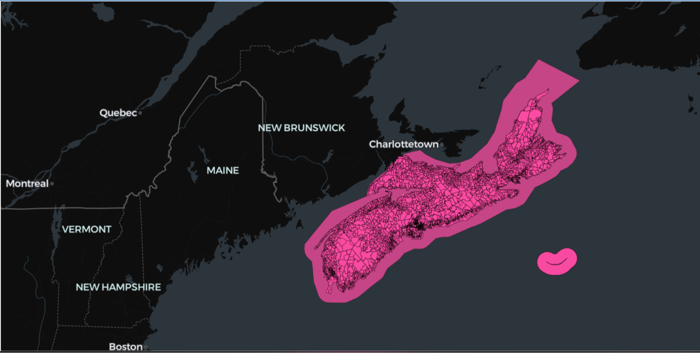

# SedonaDB Guide

This page explains how to process vector data with SedonaDB.

You will learn how to create SedonaDB DataFrames, run spatial queries, and perform I/O operations with various types of files.

Let’s start by establishing a SedonaDB connection.

## Establish SedonaDB connection

Here’s how to create the SedonaDB connection:

```python
import sedona.db

sd = sedona.db.connect()
```

Now let’s see how to create SedonaDB DataFrames.

## Create SedonaDB DataFrame

**Manually creating SedonaDB DataFrame**

Here’s how to manually create a SedonaDB DataFrame:

```python
df = sd.sql("""
SELECT * FROM (VALUES
    ('one', ST_GeomFromWkt('POINT(1 2)')),
    ('two', ST_GeomFromWkt('POLYGON((-74.0 40.7, -74.0 40.8, -73.9 40.8, -73.9 40.7, -74.0 40.7))')),
    ('three', ST_GeomFromWkt('LINESTRING(-74.0060 40.7128, -73.9352 40.7306, -73.8561 40.8484)')))
AS t(val, point)""")
```

Check the contents of the DataFrame:

```python
df.show()
```

```
┌───────┬───────────────────────────────────────────────────────────────┐
│  val  ┆                             point                             │
│  utf8 ┆                              wkb                              │
╞═══════╪═══════════════════════════════════════════════════════════════╡
│ one   ┆ POINT(1 2)                                                    │
├╌╌╌╌╌╌╌┼╌╌╌╌╌╌╌╌╌╌╌╌╌╌╌╌╌╌╌╌╌╌╌╌╌╌╌╌╌╌╌╌╌╌╌╌╌╌╌╌╌╌╌╌╌╌╌╌╌╌╌╌╌╌╌╌╌╌╌╌╌╌╌┤
│ two   ┆ POLYGON((-74 40.7,-74 40.8,-73.9 40.8,-73.9 40.7,-74 40.7))   │
├╌╌╌╌╌╌╌┼╌╌╌╌╌╌╌╌╌╌╌╌╌╌╌╌╌╌╌╌╌╌╌╌╌╌╌╌╌╌╌╌╌╌╌╌╌╌╌╌╌╌╌╌╌╌╌╌╌╌╌╌╌╌╌╌╌╌╌╌╌╌╌┤
│ three ┆ LINESTRING(-74.006 40.7128,-73.9352 40.7306,-73.8561 40.8484) │
└───────┴───────────────────────────────────────────────────────────────┘
```

Check the type of the DataFrame.

```python
type(df)

sedonadb.dataframe.DataFrame
```

**Create SedonaDB DataFrame from files in S3**

For most production applications, you will create SedonaDB DataFrames by reading data from a file.  Let’s see how to read GeoParquet files in AWS S3 into a SedonaDB DataFrame.

Import the required libraries and set environment variables:

```python
import os

os.environ["AWS_SKIP_SIGNATURE"] = "true"
os.environ["AWS_DEFAULT_REGION"] = "us-west-2"
```

Read in the Overture divisions table into a SedonaDB DataFrame and create a view:

```python
sd.read_parquet(
    "s3://overturemaps-us-west-2/release/2025-08-20.0/theme=divisions/type=division_area/"
).to_view("division_area")
```

Let’s now run some spatial queries.

**Read from GeoPandas DataFrame**

This section shows how to convert a GeoPandas DataFrame into a SedonaDB DataFrame.

Start by reading a FlatGeoBuf file into a GeoPandas DataFrame:

```python
path = "https://raw.githubusercontent.com/geoarrow/geoarrow-data/v0.2.0/natural-earth/files/natural-earth_cities.fgb"
gdf = gpd.read_file(path)
```

Now convert the GeoPandas DataFrame to a SedonaDB DataFrame and view three rows of content:

```
df = sd.create_data_frame(gdf)
df.show(3)

┌──────────────┬──────────────────────────────┐
│     name     ┆           geometry           │
│     utf8     ┆           geometry           │
╞══════════════╪══════════════════════════════╡
│ Vatican City ┆ POINT(12.4533865 41.9032822) │
├╌╌╌╌╌╌╌╌╌╌╌╌╌╌┼╌╌╌╌╌╌╌╌╌╌╌╌╌╌╌╌╌╌╌╌╌╌╌╌╌╌╌╌╌╌┤
│ San Marino   ┆ POINT(12.4417702 43.9360958) │
├╌╌╌╌╌╌╌╌╌╌╌╌╌╌┼╌╌╌╌╌╌╌╌╌╌╌╌╌╌╌╌╌╌╌╌╌╌╌╌╌╌╌╌╌╌┤
│ Vaduz        ┆ POINT(9.5166695 47.1337238)  │
└──────────────┴──────────────────────────────┘
```

## Spatial queries

Let’s see how to run spatial operations like filtering, joins, and clustering algorithms.

***Spatial filtering***

Let’s run a spatial filtering operation to fetch all the objects in the following polygon:

```python
nova_scotia_bbox_wkt = "POLYGON((-66.5 43.4, -66.5 47.1, -59.8 47.1, -59.8 43.4, -66.5 43.4))"

ns = sd.sql(f"""
SELECT country, region, names, geometry FROM division_area
WHERE ST_Intersects(geometry, ST_SetSRID(ST_GeomFromText('{nova_scotia_bbox_wkt}'), 4326))
""")
```

Take a look at the data contained in the `ns` DataFrame:

```
ns.show(3)

┌──────────┬──────────┬──────────────────────────────────────┬─────────────────────────────────────┐
│  country ┆  region  ┆                 names                ┆               geometry              │
│ utf8view ┆ utf8view ┆ struct(primary utf8, common map(fie… ┆               geometry              │
╞══════════╪══════════╪══════════════════════════════════════╪═════════════════════════════════════╡
│ CA       ┆          ┆ {primary: Canada, common: {hy: Կան… ┆ MULTIPOLYGON(((-117.8317675 49.000… │
├╌╌╌╌╌╌╌╌╌╌┼╌╌╌╌╌╌╌╌╌╌┼╌╌╌╌╌╌╌╌╌╌╌╌╌╌╌╌╌╌╌╌╌╌╌╌╌╌╌╌╌╌╌╌╌╌╌╌╌╌┼╌╌╌╌╌╌╌╌╌╌╌╌╌╌╌╌╌╌╌╌╌╌╌╌╌╌╌╌╌╌╌╌╌╌╌╌╌┤
│ CA       ┆          ┆ {primary: Canada, common: {hy: Կան… ┆ MULTIPOLYGON(((-59.7502166 44.2338… │
├╌╌╌╌╌╌╌╌╌╌┼╌╌╌╌╌╌╌╌╌╌┼╌╌╌╌╌╌╌╌╌╌╌╌╌╌╌╌╌╌╌╌╌╌╌╌╌╌╌╌╌╌╌╌╌╌╌╌╌╌┼╌╌╌╌╌╌╌╌╌╌╌╌╌╌╌╌╌╌╌╌╌╌╌╌╌╌╌╌╌╌╌╌╌╌╌╌╌┤
│ CA       ┆ CA-NS    ┆ {primary: Seal Island, common: , ru… ┆ POLYGON((-66.0528452 43.4531336,-6… │
└──────────┴──────────┴──────────────────────────────────────┴─────────────────────────────────────┘
```

You can see it only includes the divisions in the Nova Scotia area.  Skip to the visualization section to see how this data can be graphed on a map.

***K-nearest neighbors (KNN) joins***

Create `restaurants` and `customers` tables so we can demonstrate the KNN join functionality.

```sql
CREATE table restaurants AS (
    SELECT * FROM (VALUES
        (101, ST_Point(-74.01, 40.71), 'Pizza Palace'),
        (102, ST_Point(-73.99, 40.69), 'Burger Barn'),
        (103, ST_Point(-74.02, 40.72), 'Taco Town'),
        (104, ST_Point(-73.98, 40.75), 'Sushi Spot'),
        (105, ST_Point(-74.05, 40.68), 'Deli Direct')
    ) AS t(id, location, name)
)

CREATE table  customers AS (
    SELECT * FROM (VALUES
        (1, ST_Point(-74.0, 40.7), 'Alice'),
        (2, ST_Point(-73.9, 40.8), 'Bob'),
        (3, ST_Point(-74.1, 40.6), 'Carol')
    ) AS t(id, location, name)
)
```

Perform a KNN join to identify the two restaurants that are nearest to each customer:

```sql
SELECT
    c.name AS customer,
    r.name AS restaurant
FROM customers c, restaurants r
WHERE ST_KNN(c.location, r.location, 2, false)
ORDER BY c.name, r.name;
```

Here are the results:

```
┌──────────┬──────────────┐
│ customer ┆  restaurant  │
│   utf8   ┆     utf8     │
╞══════════╪══════════════╡
│ Alice    ┆ Burger Barn  │
├╌╌╌╌╌╌╌╌╌╌┼╌╌╌╌╌╌╌╌╌╌╌╌╌╌┤
│ Alice    ┆ Pizza Palace │
├╌╌╌╌╌╌╌╌╌╌┼╌╌╌╌╌╌╌╌╌╌╌╌╌╌┤
│ Bob      ┆ Pizza Palace │
├╌╌╌╌╌╌╌╌╌╌┼╌╌╌╌╌╌╌╌╌╌╌╌╌╌┤
│ Bob      ┆ Sushi Spot   │
├╌╌╌╌╌╌╌╌╌╌┼╌╌╌╌╌╌╌╌╌╌╌╌╌╌┤
│ Carol    ┆ Deli Direct  │
├╌╌╌╌╌╌╌╌╌╌┼╌╌╌╌╌╌╌╌╌╌╌╌╌╌┤
│ Carol    ┆ Pizza Palace │
└──────────┴──────────────┘
```

Notice how each customer has two rows - one for each of the two closest restaurants.

## Files

You can read GeoParquet files with SedonaDB, see the following example:

```python
df = sd.read_parquet("some_file.parquet")
```

Once you read the file, you can easily expose it as a view and query it with spatial SQL.

## Visualize results

You can use lonboard to map a SedonaDB DataFrame.

Let’s use the Nova Scotia divisions table we created earlier.

```python
import lonboard

ns.to_view("ns_divisions")

df = sd.sql("""
SELECT UNNEST(names), geometry FROM ns_divisions WHERE region = 'CA-NS'
""")

lonboard.viz(df)
```

Take a look at the map:


